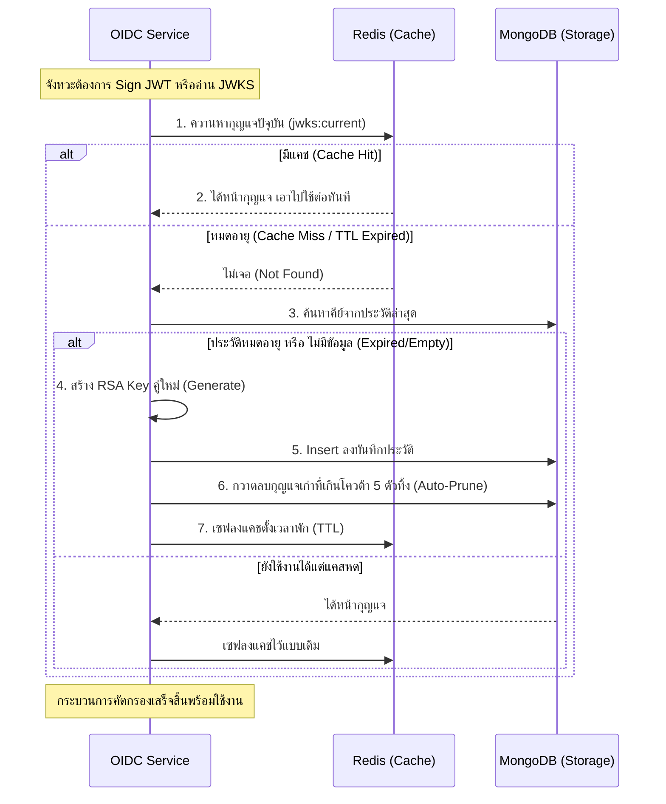

# Go OAuth 2.0 & OIDC Server

โปรเจกต์นี้คือเซิร์ฟเวอร์สำหรับจัดการการยืนยันตัวตน (Authentication) และสิทธิ์การเข้าถึง (Authorization) ที่พัฒนาขึ้นโดยใช้ภาษา Go โดยเน้นสถาปัตยกรรมแบบ Clean Architecture และรองรับมาตรฐานฟีเจอร์ของ **OAuth 2.0 ร่วมกับ OpenID Connect (OIDC)** 

---

## 🛠 Technology Stack
- **Language**: Go 1.22+ (ใช้ Standard Routing `net/http`)
- **Primary Database**: MongoDB (สำหรับเก็บ Users และ Clients)
- **Cache/Session/Transient Store**: Redis (สำหรับเก็บ Authorization Codes และ Token ชั่วคราว)
- **Cryptography**: `crypto/rsa`, `golang-jwt/jwt/v5` สำหรับแจก JWT และทำ JWKS

---

## 📂 โครงสร้างโปรเจกต์ (Project Structure)

โปรเจกต์นี้ยึดรูปแบบ Standard Layout และเน้นแยกส่วนโค้ดเพื่อให้อ่านง่าย:

├── cmd/
│   ├── client/                  # [NEW] แอปทดสอบ Ralying Party (ยิงขอดู OIDC) พอร์ต 3000
│   │   └── main.go              
│   └── server/
│       └── main.go              # จุดเริ่มต้นโปรแกรม OIDC Server พอร์ต 8080
├── internal/
│   ├── config/                  # จัดการตัวแปร Environment Variables
│   ├── adapters/                # เชื่อมต่อ Database และ Redis
│   │   ├── mongo_store/         # User, Client, RefreshToken, RSA Keys
│   │   └── redis_store/         # Cache (AuthCode, Session, Transaction)
│   ├── core/                    # **ส่วนกลาง** Business Logic ของ OIDC และ Model
│   │   ├── models/              
│   │   ├── ports/               
│   │   └── services/            # บริการต่างๆ (OAuthService, KeyService)
│   └── handlers/                # หน้าต่างรับ Request (HTTP Handlers)
│       ├── admin.go             # จัดการระบบขึ้นทะเบียน Client
│       ├── discovery.go         # API สำหรับ Discovery และ JWKS
│       ├── oauth.go             # API คุมการ Login, Token, Consent ฯลฯ
│       └── register.go          # ระบบสมัครสมาชิก
├── pkg/
│   └── crypto/                  # เครื่องมือ Helper (ระบบสร้าง RSA Key)
├── templates/                   # หน้าจอ UI ต่างๆ (Login, Consent, Admin)
├── docker-compose.yml           # ไฟล์ตั้งค่า Docker ประกอบร่าง Mongo/Redis
└── go.mod / go.sum

---

## 🚀 วิธีการรันโปรเจกต์ (How to run locally)

1. **เปิดตู้คอนเทนเนอร์ฐานข้อมูล (MongoDB & Redis)**
   เราได้เตรียม `docker-compose.yml` เอาไว้ให้แล้ว ให้สั่งคำสั่งนี้ที่ Root path ของโปรเจกต์:
   ```bash
   docker-compose up -d
   ```

2. **ดาวน์โหลด Dependencies ของ Go**
   ```bash
   go mod tidy
   ```

3. **สั่งรันเซิร์ฟเวอร์หลัก (OIDC Server)**
   เปิด Terminal ของคุณและสั่งรันขุมพลังหลักที่เตรียมมา:
   ```bash
   go run cmd/server/main.go
   ```
   *ใช้งานได้ที่ `http://localhost:8080/admin/dashboard` (User/Pass: `admin`/`admin_password`)*

4. **ทดสอบกับ Client App ตัวอย่าง**
   เมื่อสร้าง Client จากหน้า Admin Dashboard ของเซิร์ฟเวอร์หลักแล้ว ให้นำ `client_id` และ `client_secret` เข้าไปเปลี่ยนในบรรทัดแรกๆ ของโค้ด `cmd/client/main.go` จากนั้น... เปิด Terminal หน้าต่างที่สองแล้วสั่งรันขนานกันไปเลย:
   ```bash
   go run cmd/client/main.go
   ```
   *ใช้งานฝั่งแอปได้ที่ `http://localhost:3000`*

---

## 🌟 ฟีเจอร์ใหม่ล่าสุดและระดับความปลอดภัยขั้นสูง (Latest Capabilities)

โปรเจกต์นี้ได้รับการยกระดับให้สอดคล้องกับมาตรฐาน OpenID Connect อย่างเข้มงวด:
- **🔒 Multi-Algorithm Token Signing**: แจก Access/ID Token ผ่านอัลกอริธึมชั้นนำระดับโลก (`RS256`, `ES256`, `EdDSA`) โดยผูกอัตโนมัติจากคอนฟิกของแต่ละ Client
- **👥 Pairwise Subject Identifiers**: รองรับ `subject_type=pairwise` ปกปิดประวัติผู้ใช้งานข้าม Client ป้องกันการตามรอยผู้ใช้ผ่านการแฮช Sub Identifier ด้วย Salt ถาวร
- **🛂 Strict Client Authentication Methods (`token_endpoint_auth_method`)**:
  - รองรับ `client_secret_basic` (Authorization Header)
  - รองรับ `client_secret_post` (Body Payload)
  - รองรับ `none` สำหรับ Public Clients (แอปมือถือ, SPA)
- **🌍 OIDC Scopes & Claims Dynamic Mapping**: การันตีว่าเมื่อร้องขอ `profile` หรือ `email` ผ่าน `/authorize` จะทำการสะท้อนและ Mapping Claims เข้ากับ `id_token` หรือส่งออก `/userinfo` ให้อย่างแนบเนียน
- **🔥 Secure Introspection (RFC 7662)**: ล็อกเป้า Endpoint `POST /introspect` ให้ตอบการสืบค้นสถานะเฉพาะกับ Client ที่มีตัวตนจริงและส่ง Credentials ถูกต้องเท่านั้น ป้องกันปัญหา Scanning Attack
- **🚀 CORS Ready**: เปิดใช้งาน `CORSMiddleware` แบบเบ็ดเสร็จ อนุญาตให้ดึง Discovery JS/Metadata ไปใช้จากหน้าเบราว์เซอร์สำหรับนักพัฒนา OIDC Client ได้อย่างไร้รอยต่อ

---

## 🗝️ สถาปัตยกรรม Key Management (JWKS)

ระบบการจัดการกุญแจเข้ารหัส (RSA Key Pair) สำหรับโปรเจกต์นี้ถูกออกแบบเป็น **Graceful Key Rotation แบบ Hybrid (MongoDB + Redis)** ทรงประสิทธิภาพระดับ Enterprise โดยทำงานผ่าน Cache เพื่อรองรับการสเกลแบบ Multiple Instances (Stateless):

1. **Redis Caching (`jwks:current`)**: ทำหน้าที่เป็นหน้าด่านคอยแคชกุญแจตัวปัจจุบัน (Active Key) ทำให้เซิร์ฟเวอร์ดึงไปแจก Access Token (JWT) ได้รวดเร็ว โดยผูก TTL หมดอายุตามค่าตัวแปร `KEY_ROTATION_DURATION` (ค่าตั้งต้น 30 วัน)
2. **MongoDB Fallback & Persistence**: ต้นแบบกุญแจจะถูกฝังประวัติไว้ใน Collection `keys` ถ้าระบบพบว่ากุญแจใน Redis หมดอายุการใช้งานแล้ว เซิร์ฟเวอร์จะสั่งปั่นกุญแจตัวใหม่ (Generate New Key) ส่งเข้าไปเรียงตัวใน MongoDB และดึงกลับไปพักใน Redis คืน ทำให้การผลัดเปลี่ยนกุญแจ (Key Rotation) เกิดขึ้นได้อย่างรวดเร็วและเป็นอัตโนมัติ
3. **Grace Period & Auto-Prune**: 
   - ระบบดูแล Token เก่าๆ อย่างนุ่มนวล โดยเมื่อมีคำขอมาที่ Endpoint `/jwks.json` แทนที่จะตอบแค่กุญแจตัวล่าสุดเพียงตัวเดียว ระบบจะเอาประวัติกุญแจเก่าที่เพิ่งหมดอายุไปไม่เกิน 14 วัน (`KEY_GRACE_PERIOD`) ส่งไปโชว์คู่กันด้วย ช่วยให้ระบบฝั่ง Client ยังคง Verify ค่าเก่าได้ไม่มีกระตุก (Downtime 0%)
   - **Auto-Prune**: ระบบจะควบคุมขยะและข้อมูลบวมใน Database ให้มีประวัติกองอยู่ไม่เกินเพดานสูงสุดตลอดกาล (`KEY_MAX_RETENTION_COUNT` = 5 อัน) กุญแจที่เกินจากโควต้าจะถูกลบกวาดทิ้งให้เองทันทีแบบเนียนๆ

### 📊 แผนภาพจำลองการทำงาน (Flow Diagram)



---

## 🌐 Endpoints ปัจจุบัน (API อ้างอิง)

### 📌 Discovery & Metadata
| Method | Endpoint | รายละเอียด |
| :-: | --- | --- |
| `GET` | `/.well-known/openid-configuration` | **OIDC Discovery**: แสดงค่า Metadata และความสามารถที่ Server นี้รองรับ |
| `GET` | `/jwks.json` | **JWKS**: ปล่อย Public Keys สำหรับให้ Client ตรวจสอบลายเซ็น JWT ด้วยตัวเอง |

### 📖 คู่มือทำความเข้าใจ OIDC Discovery (`/.well-known/openid-configuration`)

ไฟล์ Discovery เปรียบเสมือน "สมุดหน้าเหลือง" ที่บอกคู่มือและวิธีการสื่อสารทั้งหมดของ OIDC Server นี้ เพื่อให้นักพัฒนาแอปฝั่ง Client รู้ว่าต้องเซ็ตอัประบบหลังบ้านให้คุยกันอย่างไร:

| Parameter ใน Discovery | ความสำคัญและวิธีนำไปใช้งาน |
| --- | --- |
| `issuer` | **นามบัตรประจำตัวเซิร์ฟเวอร์** (เช่น `http://localhost:8080`) เซิร์ฟเวอร์นี้จะประทับตรา URL นี้ลงในฟีลด์ `iss` ของ `id_token`<br/>👉 *สิ่งที่ Client ต้องทำ:* ตรวจสอบว่าใน `id_token` ตรงกับค่านี้ เพื่อป้องกันเซิร์ฟเวอร์ปลอมสวมรอย |
| `authorization_endpoint` / `token_endpoint` | ช่องทางพื้นฐานที่ใช้ในการรับส่งผู้ใช้ ยิงคำขอโค้ด และสั่งแลกเป็น Access Token ให้ถูกต้อง |
| `userinfo_endpoint` | ขุมทรัพย์ข้อมูลส่วนบุคคล (Profile/Email) Client ต้องใช้ Access Token แนบเป็น `Bearer` เคาะถามข้อมูลจากช่องทางนี้ |
| `jwks_uri` | **แม่กุญแจสาธารณะ (Public Keys)** Client ฝั่งล็อกอินต้องโหลดกุญแจทั้งหมดจาก URL นี้ ไปแกะรอยและตรวจสอบลายเซ็นของ JWT ได้ด้วยตัวเองโดยไม่ต้องยิงกลับมาภาระให้เซิร์ฟเวอร์ |
| `revocation_endpoint` | ลานประหาร Token หากระบบตรวจพบว่าเครื่องมือถือของผู้ใช้งานผีเข้าหรือสั่ง Logout ระบบสามารถส่งคำขอมาทำลายเครื่องราง (`refresh_token`) ทิ้งได้ทันที |
| `introspection_endpoint` | **เครื่องสแกนกรรม Token** สำหรับ "Resource Server" (API ข้างนอก) ที่ไม่ดึง Key ไปตรวจเอง ก็แค่แวะส่ง Token มาหาเราที่นี่ เพื่อฟันธงเลยว่าหมดอายุหรือโดนแบนเพิกถอนไปหรือยัง |
| `end_session_endpoint` | (RP-Initiated Logout) จุดที่ OIDC Server เปิดรับให้แอปฝั่งลูกข่ายพาลูกเรือกระโดดร่มลงมากวาดล้าง Session Cookie บัญชีตรงกลางให้สะอาดสะอ้าน |
| `scopes_supported` | แคตตาล็อกของสิทธิการเข้าถึงข้อมูลทั้งหมดที่อนุญาตให้ขอได้ เช่น `openid`, `profile`, `email`, `offline_access` |
| `subject_types_supported` | นโยบายการระบุตัวตน <ul><li>`public`: ใช้ ID สมาชิกตรงๆ</li><li>`pairwise`: แอบเข้ารหัสปกปิดไอดี กันดารา/สตรีมเมอร์โดนแอปภายนอกเอาข้อมูลไปผูกโยงเข้าหากัน (Anti-Tracking)</li></ul> |
| `id_token_signing_alg_values_supported` | ตรารับรองลายเซ็นที่รองรับ (ตัวนี้ทรงพลังสุด รองรับยิง `RS256`, `ES256`, หรือขั้นสุดยอด `EdDSA`) |
| `token_endpoint_auth_methods_supported` | จุดรีดข้อมูล Client Authentication! บังคับว่าคุณจะต้องพิสูจน์รหัสผ่านด้วย `client_secret_basic`, ส่งไปกับกล่องข้อความ (`client_secret_post`) หรือฟรีสไตล์สำหรับแอปมือถือ (`none`) |
| `code_challenge_methods_supported` | มาตรการความปลอดภัย PKCE (`S256`) บังคับให้แอปพลิเคชันต้องเข้ารหัสผ่านแบบลูกโซ่ เพื่อสกัดคนแอบดักจับ `code` ในอากาศ |


### 🔐 OAuth & OIDC Core
| Method | Endpoint | รายละเอียด |
| :-: | --- | --- |
| `GET` | `/authorize` | จุดเริ่มต้นของ Authorization Code Flow รองรับพารามิเตอร์ PKCE |
| `POST` | `/login` / `/register` | ส่งคำขอเข้าสู่ระบบหรือสมัครสมาชิกเพื่อแลกเปลี่ยน Transaction ID |
| `GET/POST`| `/consent` | หน้าจอยินยอมสิทธิ์ (Consent Screen) รับรองการยิง Token กลับไปให้แพลตฟอร์มปลายทาง |
| `POST` | `/token` | แลกเปลี่ยน Code หรือ Credential เป็น Access Token รองรับ 3 Grant Types |
| `GET` | `/userinfo` | ปกป้องโปรไฟล์ผู้ใช้งานด้วย Access Token เพื่อตอบกลับตามมาตรฐาน OIDC |

### 🛑 Session & Security
| Method | Endpoint | รายละเอียด |
| :-: | --- | --- |
| `POST` | `/introspect` | ระบบเครื่องสแกนลายเซ็น (Introspection ตาม RFC 7662) เอาไว้ให้ API ข้างนอกยิงมาตรวจว่า Token นี้ของจริงและหมดอายุไปหรือยัง |
| `GET` | `/logout` | **RP-Initiated Logout**: ลงชื่อออกจากระบบขุดรากถอนโคนของ Session ภายใน OIDC ทั้งหมด |
| `POST` | `/revoke` | ทำลายล้าง `refresh_token` เก่า (ตาม RFC 7009) เวลาแอปฝั่งลูกข่ายต้องการปิดระบบ |

### 🛠️ Admin Zone
| Method | Endpoint | รายละเอียด |
| :-: | --- | --- |
| `GET` | `/admin/dashboard` | หน้าแสดงรายการและการสั่งสร้าง Client Application ใหม่ ปกป้องด้วย Basic Auth |
| `POST` | `/admin/clients/ui` | สร้าง Client ผ่านหน้า Web UI (Form) |
| `POST` | `/admin/clients` | สร้าง Client ผ่าน JSON API |
| `POST` | `/admin/users` | สร้าง User ผ่าน JSON API |

---

## 🔑 Grant Types ที่รองรับ — อธิบายแต่ละประเภท

OAuth 2.0 กำหนด "Grant Type" คือ **วิธีที่ Client จะขอ Access Token** แต่ละวิธีเหมาะกับสถานการณ์ต่างกัน

---

### 1. `authorization_code` — สำหรับ Web App / Mobile มี User

**ใช้เมื่อ:** แอปต้องการให้ User เข้าสู่ระบบ แล้วได้รับ Token ของ User คนนั้น

**ทำไมถึงปลอดภัย:** แอปไม่เคยเห็น Password ของ User เลย เพราะ OIDC Server เป็นคนรับและตรวจสอบ แอปได้แค่ Authorization Code กลับมา แล้วค่อยแลกเป็น Token

```
Browser                Client App              OIDC Server
   │                       │                       │
   │──── คลิก Login ───────▶│                       │
   │                       │──── Redirect ──────────▶│
   │◀──────────────────────────── หน้า Login ────────│
   │──── กรอก Password ─────────────────────────────▶│ ← Password อยู่แค่นี่!
   │◀──────────────── Consent Screen ───────────────│
   │──── กด Allow ──────────────────────────────────▶│
   │◀────────────────── redirect+code ──────────────│
   │──── code กลับมา ──────▶│                       │
   │                       │──── POST /token ───────▶│
   │                       │◀──── Access Token ──────│
```

**ต้องการ PKCE ไหม?**  
- **Public Client** (SPA, Mobile App): **บังคับ** — ป้องกัน Authorization Code Interception
- **Confidential Client** (Web Server, BFF): ส่ง `client_secret` แทนได้

```bash
# Step 1: เริ่ม Authorization Flow
GET /authorize?
  response_type=code
  &client_id=MY_CLIENT
  &redirect_uri=https://app.com/callback
  &scope=openid profile email
  &state=random_csrf_token
  &code_challenge=BASE64URL(SHA256(code_verifier))   ← PKCE
  &code_challenge_method=S256

# Step 2: แลก Code เป็น Token
POST /token
  grant_type=authorization_code
  code=AUTH_CODE
  redirect_uri=https://app.com/callback
  code_verifier=ORIGINAL_RANDOM_STRING             ← PKCE
  client_id=MY_CLIENT
  client_secret=MY_SECRET                          ← Confidential Client เท่านั้น
```

**Response:**
```json
{
  "access_token": "eyJ...",
  "refresh_token": "...",
  "id_token": "eyJ...",
  "token_type": "Bearer",
  "expires_in": 3600
}
```

**ตัวอย่าง Use Case:** Sign in with Google, LINE Login, Facebook Login

---

### 2. `refresh_token` — ต่ออายุ Token โดยไม่ต้อง Login ใหม่

**ใช้เมื่อ:** Access Token หมดอายุ ต้องการขอใหม่โดยไม่กวน User ให้ Login ซ้ำ

**ทำไมถึงต้องมี:** Access Token ออกแบบมาให้อายุสั้น (เช่น 1 ชั่วโมง) เพื่อความปลอดภัย แต่ถ้าบังคับให้ Login ใหม่ทุกชั่วโมง User จะรำคาญ Refresh Token จึงเป็นตัวกลางที่อยู่ได้นาน (30 วัน) ใช้แลก Access Token ใหม่เงียบ ๆ

```
Client App              OIDC Server
    │                       │
    │ ── POST /token ───────▶│   grant_type=refresh_token
    │                       │   refresh_token=LONG_LIVED_TOKEN
    │◀── Access Token ───────│   ← Token ชุดใหม่ อายุ 1 ชั่วโมง
    │   (Refresh Token ใหม่)  │   ← Refresh Token หมุนเวียน (Rotation)
```

```bash
POST /token
  grant_type=refresh_token
  refresh_token=REFRESH_TOKEN_STRING
  client_id=MY_CLIENT
  client_secret=MY_SECRET       ← ถ้าเป็น Confidential Client
```

**Response:**
```json
{
  "access_token": "eyJ...ใหม่...",
  "refresh_token": "...ใหม่...",
  "id_token": "eyJ...ใหม่...",
  "token_type": "Bearer",
  "expires_in": 3600
}
```

> ⚠️ **Refresh Token Rotation**: ทุกครั้งที่ใช้ Refresh Token จะได้ชุดใหม่กลับมา ของเดิมถูก invalidate ทันที ป้องกัน Token Theft

**ต้องการ Scope `offline_access`:** Client ต้องขอ scope นี้ตอน `/authorize` จึงจะได้ Refresh Token กลับมา

---

### 3. `client_credentials` — สำหรับ Machine-to-Machine (M2M)

**ใช้เมื่อ:** ระบบต้องการคุยกับระบบอื่นโดยตรง ไม่มี User เข้ามาเกี่ยวข้อง เช่น Microservices, Background Jobs, Cron Tasks

**ทำไมถึงต้องมี:** หากใช้ API Key แบบ hardcode ในโค้ด ถ้าหลุดออกไปจะถูกใช้งานได้ตลอดไป `client_credentials` แก้ปัญหานี้ด้วยการออก JWT ที่หมดอายุเองอัตโนมัติ

```
Order Service           OIDC Server         Payment Service
     │                      │                     │
     │── POST /token ───────▶│ client_id+secret    │
     │◀── Access Token ──────│ (อายุ 1 ชั่วโมง)    │
     │                      │                     │
     │── API Call + Bearer ──────────────────────▶│
     │                      │                     │ ตรวจ Token
     │                      │◀─── GET /jwks.json ─│ ด้วย Public Key
     │◀──────────────────────────── Response ──────│
```

```bash
# วิธีที่ 1: Basic Auth (แนะนำ)
curl -X POST http://localhost:8080/token \
  -u "CLIENT_ID:CLIENT_SECRET" \
  -d "grant_type=client_credentials&scope=read:orders"

# วิธีที่ 2: Body Parameters
curl -X POST http://localhost:8080/token \
  -d "grant_type=client_credentials" \
  -d "client_id=CLIENT_ID" \
  -d "client_secret=CLIENT_SECRET" \
  -d "scope=read:orders"
```

**Response:** (ไม่มี `refresh_token` และ `id_token` เพราะไม่มี User)
```json
{
  "access_token": "eyJ...",
  "token_type": "Bearer",
  "expires_in": 3600,
  "scope": "read:orders"
}
```

> ⚠️ ต้องการ **Confidential Client เท่านั้น** (ต้องมี `client_secret`)  
> ⚠️ ต้อง tick **`client_credentials`** ใน Grant Types ตอนสร้าง Client ผ่าน Admin Dashboard

**ตัวอย่าง Use Case:** Stripe → ระบบของลูกค้า, GitHub Actions → API, Cron Job → Analytics Service

---

### สรุปเปรียบเทียบ

| | `authorization_code` | `refresh_token` | `client_credentials` |
|---|:---:|:---:|:---:|
| มี User เกี่ยวข้อง | ✅ | ✅ (ต่อจาก auth_code) | ❌ |
| ต้องการ Browser | ✅ | ❌ | ❌ |
| ได้ Access Token | ✅ | ✅ | ✅ |
| ได้ Refresh Token | ✅ (ถ้ามี `offline_access`) | ✅ (ชุดใหม่) | ❌ |
| ได้ ID Token | ✅ (ถ้ามี `openid`) | ✅ | ❌ |
| Client Type | Public / Confidential | Public / Confidential | **Confidential เท่านั้น** |
| `sub` ใน Token | User ID | User ID | **Client ID** |
| Use Case | Login ด้วย User | ต่ออายุ Session | M2M / Service-to-Service |


แผนที่ **OIDC Discovery (`openid-configuration`)** อันนี้ถูกร้อยเรียงมาให้สอดคล้องกันแบบมีนัยสำคัญมากครับ ทุกค่านอกจากจะทำหน้าที่เป็นเส้นทาง (Endpoint) แล้ว มันยังพึ่งพิงฟีเจอร์กันและกันเหมือนโซ่เฟืองเพื่อให้เกิดระบบ Security ที่สมบูรณ์แบบครับ 

ผมขอจัดกลุ่มเพื่ออธิบายความสอดคล้องกันให้เห็นภาพชัดเจนขึ้นนะครับ:

---

### 📍 กลุ่มที่ 1: "ป้ายบอกทาง" สำหรับวงจรชีวิตผู้ใช้งาน (Flow Operations)
กลุ่มแรกจะเป็นคู่หู URL ขาไป-ขากลับ ที่แอปหน้าบ้าน (Client) ต้องใช้โยนลูกค้าระหว่างกัน:

- **`authorization_endpoint`** (`/authorize`) ➡️ หน้าประตูแรกสุด เอาไว้ให้แอปส่ง User มาเปิดหน้า Login / Consent ของเรา (เริ่มต้น Auth Code Flow)
- **`token_endpoint`** (`/token`) ➡️ หน้าต่างรับแลกของ! หลังจากผ่านด่านแรกจนได้ `code` กลับไป แอปต้องเอา `code` แอบเดินมาช่องทางนี้เพื่อแลกเป็น **Access Token** (และ ID Token)
- **`userinfo_endpoint`** (`/userinfo`) ➡️ เมื่อแอปได้ Access Token จากด่านแลกของแล้ว สามารถนำมาเคาะที่นี่เพื่อขอดูข้อมูล Profile, Email ของ User 
- **`end_session_endpoint`** (`/logout`) ➡️ ประตูทางออก เมื่อแอปทำ Logout ก็จะมาเรียกที่นี่เพื่อให้ OIDC Server เคลียร์ Session Cookie ทิ้งแบบเบ็ดเสร็จ (RP-Initiated Logout)

---

### 🛡 กลุ่มที่ 2: คู่ตรวจสอบความถูกต้องขั้นสูง (Token Verification & Security)
กลุ่มนี้สอดคล้องกับเรื่องการพิสูจน์ "ของแท้" ป้องกันแฮกเกอร์ปลอม Token:

- **`issuer`** 
  - เบสของการอ้างสิทธิ! สำคัญมากเพราะเซิร์ฟเวอร์จะฝังค่านี้ไว้ใน `id_token` ตรงฟิลด์คำว่า `"iss"` Client ต้องนำค่าใน Discovery ไปเทียบกับ Token เสมอว่าตรงกันไหม (ป้องกันคนแอบอ้างทำ Token เลียนแบบ)
- **`jwks_uri`** (`/jwks.json`) 
  - แม่กุญแจสาธารณะ (Public Key) ที่เปิดให้ Client โหลดไปแกะรอยลายเซ็น (Signature) ของตัว `id_token` ว่า `issuer` เจ้านี้เป็นคนปริ้นท์ออกมาจริงๆ
- **`id_token_signing_alg_values_supported`** 
  - ทำงานควบคู่กับ `jwks_uri` คือเป็นตัวบอกว่าแม่กุญแจบน JWKS อันนั้นใช้ **อัลกอริทึม** เข้ารหัสลับแบบไหน (ในระบบคุณใช้ `RS256`, `ES256`, `EdDSA`) เพื่อให้ Client เตรียมคณิตศาสตร์ไปถอดรหัสได้ถูกท่า
- **`introspection_endpoint`** (`/introspect`) 
  - ไว้สำหรับโปรแกรมที่ไม่เก่งพอมองลายเซ็น Token ไม่ออก ก็แค่วิ่งเอา Token มาโยนถามที่นี่ ให้เซิร์ฟเวอร์เราเป็นคนเช็คให้แทนว่าเป็น "ของแท้" และ "ยังไม่หมดอายุ" ใช่ไหม
- **`revocation_endpoint`** (`/revoke`) 
  - ลานประหาร เมื่อแอปเห็นว่า Token หลุดหรือคนเลิกใช้งาน ก็เอาตัว Refresh Token มารายงานตัวที่นี่ ระบบจะแบนทิ้งทันที!

---

### ⛓️ กลุ่มที่ 3: ระบบควบคุมพฤติกรรมระหว่าง Client กับรหัสผ่าน (Auth Methods)
กลุ่มนี้จะสอดคล้องกันในการบังคับวิธีการพูดคุยระหว่างระบบและ Client:

- **`grant_types_supported`** 
  - สไตล์การขอ Token เช่น ถ้าอนุญาต `authorization_code` (สำหรับเว็บ) หรือ `client_credentials` (สำหรับ Machine คุยกัน) 
- **`response_types_supported`** 
  - ตัวแปรตั้งต้นตอน `/authorize` ควบคู่เรื่องตรรกะว่าแอปสามารถเรียกร้องค่าตอบกลับรูปแบบไหนได้บ้าง? ส่วนใหญ่นิยมใช้แค่ค่า `code` เดี่ยวๆ เพื่อความปลอดภัย
- **`token_endpoint_auth_methods_supported`** 
  - เป็นตัวควบคุม **"วิธีการส่งรหัสผ่าน"** ของ Client มาที่ `/token`, `/introspect` หรือ `/revoke` (ในที่นี้คือสั่งบังคับว่าแอปต้องใส่รหัส Basic Auth Header, แอบแนบใน Body Parameter หรือ `none` สำหรับระบบที่ไม่มี Secret อย่างแอปมือถือ)
- **`code_challenge_methods_supported`** 
  - กฎห้ามเด็ดขาดของ Public Client ทำงานเชื่อมกับ `authorization_endpoint` ตรงที่ ถ้าคุณดักจับ `code` ในอากาศ ระบบท้าทาย PKCE (เช่นผ่าน `S256`) จะบังคับให้แฮกเกอร์ต่อให้ลักไก่ขโมยโค้ดไป ก็จะเอาไปแลกที่ `token_endpoint` ไม่ได้อยู่ดี

---

### 👤 กลุ่มที่ 4: การอนุญาตเข้าถึงสิทธิและอัตลักษณ์ (Scopes & Identity)
กลุ่มนี้ผูกมัดกับการจัดการ "ข้อมูล" ของผู้ใช้งาน:

- **`scopes_supported`** 
  - ขอบเขตความสามารถว่ามีสินค้าอะไรเปิดให้ขอผ่าน `/authorize` ได้บ้าง เช่น ขอ `openid` (เอา ID Token), ขอ `profile` (เพื่อจะเรียก `name` ในภายหลัง)
- **`claims_supported`** 
  - ทำงานเชื่อมกับ `scopes_supported`! ถ้า Scope คือชั้นวางสินค้า Claim ก็นับเป็น ตัวชิ้นสินค้าจริงๆ ระบบเปิดให้จ่ายค่า `name`, `email` ออกไปให้เมื่อนำเอา Access Token มาแลกที่ `userinfo_endpoint`
- **`subject_types_supported`** 
  - สอดคล้องกับค่า `sub` (รหัส ID ประจำตัว User ใน Token) ซึ่งบอกว่าเราส่งข้อมูลจริงแบบตรงไปตรงมา (`public`) หรือเราแอบตบตาปิดบังผู้ใช้เป็นแฮชก้อนใหม่ (`pairwise`) 

ทั้งหมดนี้ทำงาน **"ประสานกันเป็นหนึ่งเดียว"** ครับ ถ้า Client สแกนอ่านไฟล์นี้เพียงหน้าเดียว พวกเขาจะรู้ "กฎกติกาการติดต่อ" และ "ฟีเจอร์ระดับเทพ" ทั้งหมดที่คุณทำไว้บน `OIDC` ระบบนี้โดยปริยาย 🚀

------
### Q&A
#### ASK
- client_credentials มีไว้ทำไม
#### ANSWER
- ให้ System คุยกับ System โดยไม่มี User เข้ามาเกี่ยวข้อง
ข้อดี:
- Token หมดอายุเอง → ถ้าหลุดจะถูกใช้งานได้แค่ช่วงสั้น ๆ
- Scope จำกัดได้ → Payment ขอแค่ send:notification ไม่ได้ read:users
- Audit Trail → Log ได้ว่า Service ไหนเรียกอะไร
## `client_credentials` มีไว้ทำอะไร?

### คำตอบสั้น: **ให้ System คุยกับ System โดยไม่มี User เข้ามาเกี่ยวข้อง**

---

### สถานการณ์จริง

สมมติองค์กรมี Microservices หลายตัว:

```
Order Service  →  Payment Service  →  Notification Service
```

**Order Service** ต้องการเรียก **Payment Service** เพื่อตัดเงิน  
ในกรณีนี้ **ไม่มี User นั่งกดอยู่** — มันเป็นแค่ระบบคุยกับระบบ

---

### ถ้าไม่มี `client_credentials` ต้องทำยังไง?

ต้องใช้วิธีเก่า เช่น:
- ส่ง API Key แบบ hardcode ใน Header → ถ้าหลุดไปอันตราย
- ใช้ Service Account + Basic Auth → จัดการยาก ไม่มี Expiry

---

### ด้วย `client_credentials`

```
Payment Service → POST /token (client_id + client_secret)
                        ↓
              ได้ Access Token (JWT) อายุ 1 ชั่วโมง
                        ↓
Payment Service → เรียก Notification Service พร้อม Bearer Token
Notification Service → ตรวจ Token ผ่าน /jwks.json → ✅ อนุมัติ
```

**ข้อดี:**
- Token หมดอายุเอง → ถ้าหลุดจะถูกใช้งานได้แค่ช่วงสั้น ๆ
- Scope จำกัดได้ → Payment ขอแค่ `send:notification` ไม่ได้ `read:users`
- Audit Trail → Log ได้ว่า Service ไหนเรียกอะไร

---

### ตัวอย่างจริงในโลก

| ใครใช้ | ทำอะไร |
|---|---|
| Stripe Webhook | ยืนยันตัวเองกับระบบของลูกค้า |
| GitHub Actions | เรียก API ด้วย Service Account |
| AWS Lambda | เรียก Internal API |
| Cron Job | รายงานข้อมูลไป Analytics Service |

---

### สรุป

> `authorization_code` = **User** Login เพื่อใช้ App  
> `client_credentials` = **System** Login เพื่อคุยกับ System อื่น


#### ASK
- grant_type

#### ANSWER
## OAuth 2.0 Grant Types ทั้งหมด

ตาม RFC 6749 และ Extension ที่เพิ่มมา มีทั้งหมดนี้ครับ:

---

### ✅ ที่โปรเจกต์นี้รองรับ
| Grant Type | RFC |
|---|---|
| `authorization_code` | RFC 6749 |
| `refresh_token` | RFC 6749 |
| `client_credentials` | RFC 6749 |

---

### 🚫 ที่ถูก Deprecated แล้ว (ไม่ควรใช้)

#### `implicit`
เป็น flow เก่าสำหรับ SPA ที่ออก Access Token ตรงใน URL Fragment เลย  
ปัญหา: Token โผล่ใน Browser History และ Referer Header → ถูก Deprecate ใน OAuth 2.1  
**แทนด้วย:** `authorization_code + PKCE`

```
GET /authorize?response_type=token...
← redirect กลับพร้อม #access_token=eyJ... ← อันตราย!
```

#### `password` (Resource Owner Password Credentials)
User ส่ง Username/Password โดยตรงให้ Client App  
ปัญหา: App เห็น Password → ทำลาย security model ของ OAuth ทั้งหมด → Deprecate ใน OAuth 2.1  
**แทนด้วย:** `authorization_code`

```
POST /token
  grant_type=password
  username=user@example.com
  password=P@ssw0rd          ← Client เห็น Password!
```

---

### 🆕 Extension Grant Types (ยังใช้ได้ ไม่ได้ Built-in ใน RFC 6749)

#### `urn:ietf:params:oauth:grant-type:device_code` (RFC 8628)
สำหรับอุปกรณ์ที่ไม่มี Browser เช่น Smart TV, CLI Tool, IoT

```
TV → POST /device
TV ← user_code=ABCD-1234, verification_uri=https://auth.example.com/device
TV แสดงบนจอ: "ไปที่ auth.example.com พิมพ์ ABCD-1234"
User เปิด Phone → Login → ยืนยัน
TV → Polling POST /token จนกว่าจะ approved
```

#### `urn:ietf:params:oauth:grant-type:jwt-bearer` (RFC 7523)
Client ส่ง JWT ที่ signed ด้วย Private Key เพื่อขอ Access Token แทน secret  
ใช้มากใน Google Service Account, Salesforce

#### `urn:ietf:params:oauth:grant-type:saml2-bearer` (RFC 7522)
ใช้ SAML 2.0 Assertion แลก Access Token สำหรับ Enterprise ที่ใช้ SAML อยู่แล้ว

#### `urn:ietf:params:oauth:grant-type:token-exchange` (RFC 8693)
แลก Token จาก Identity Provider อื่นเป็น Token ของระบบเรา  
ใช้ใน Federated Identity, Cross-service scenarios

---

### สรุปภาพรวม

| Grant Type | สถานะ | ใช้เมื่อ |
|---|---|---|
| `authorization_code` | ✅ Active | Web/Mobile มี User |
| `refresh_token` | ✅ Active | ต่ออายุ Token |
| `client_credentials` | ✅ Active | M2M / Service-to-Service |
| `device_code` | ✅ Active (RFC 8628) | TV, CLI, IoT |
| `jwt-bearer` | ✅ Active (RFC 7523) | Service Account |
| `token-exchange` | ✅ Active (RFC 8693) | Federation |
| `implicit` | ❌ **Deprecated** | (ใช้ auth_code+PKCE แทน) |
| `password` | ❌ **Deprecated** | (ใช้ auth_code แทน) |

-------------


#### ASK
- id_token_signing_alg_values_supported
#### ANSWER
**ใช่ครับผม! สามารถแปรเปลี่ยนหรือมีได้หลายค่าเลยครับ** เพราะมันเป็น **Array (`[]string`)** ตามสเปคของ OIDC 

และนี่คือฟิลด์ที่มีไว้บอก Client ว่า **"Hey! Server ฉันสามารถเซ็นลายเซ็นกำกับ ID Token ด้วยสมการคณิตศาสตร์ (Algorithm) รหัสไหนได้บ้างนะ"** 

---

### 🔥 ค่ายอดนิยมที่เว็บระดับโลกชอบใช้กัน (ใส่หลายค่าพร้อมกันได้):

1. **`RS256`** (RSA Signature with SHA-256) 
   *(ค่ามาตรฐานและยอดนิยมที่สุด โปรเจกต์เราก็ใช้อันนี้)*
   - ใช้กุญแจคู่ Public / Private Key 
   - ปลอดภัยและทุกภาษาเขียนโปรแกรมรองรับชัวร์ชัวร์

2. **`ES256`** (ECDSA using P-256 and SHA-256)
   - รุ่นใหม่กว่า เร็วกว่า ขนาดกุญแจเล็กกว่า RSA มาก (ประหยัดแบนด์วิดท์)
   - นิยมในระดับ Mobile App (Apple Sign-In ชอบใช้)

3. **`EdDSA`** (Edwards-curve Digital Signature Algorithm)
   - ใหม่สุด ทรงพลังและปลอดภัยสูงสุด ทนทานต่อการโจมตีแบบ Side-channel 
   - ระบบ Modern System เริ่มหันมาใช้กันเยอะขึ้น

4. **`HS256`** (HMAC with SHA-256)
   - การเซ็นแบบสมมาตร (Symmetric) ใช้กุญแจเดียวกันทั้งเซ็นและแกะ
   - **ไม่แนะนำ** ให้ประกาศในระบบ OIDC สาธารณะ เพราะเราต้องแชร์กุญแจที่ใช้เซ็นให้ Client ด้วย (หลุดง่าย)

### 💡 ตัวอย่างการแก้ Config ถ้าอนาคตเราอยากติดปีกเพิ่ม

ถ้าวันนึงโปรเจกต์คุณขยาย และรองรับทั้งกุญแจแบบ RSA และกุญแจแบบ ECDSA เราก็แค่เพิ่มค่าใน `config/local.config.yaml` เป็นแบบนี้:

```yaml
oidc:
  id_token_signing_alg_values_supported:
    - "RS256"
    - "ES256"
    - "EdDSA"
```
----
#### ASK
- subject_types_supported
#### ANSWER
`subject_types_supported` ใน OIDC มี 2 ค่าครับ:

| ค่า | ความหมาย |
|-----|-----------|
| `public` | `sub` เหมือนกันทุก client — ทุก app รู้ว่าคือ user คนเดียวกัน |
| `pairwise` | `sub` ต่างกันต่อ client — `sub` ถูก derive per-client เพื่อซ่อน identity |

---

### ระบบตอนนี้เป็นอย่างไร?

ตอนนี้ใช้ **`public`** อย่างเดียว ซึ่งถูกต้องแล้วครับ เพราะโค้ดใน `oauth_service.go` ใส่ `sub` = raw user ID ตรง ๆ:

```go
"sub": info.UserID,  // public type — ทุก client เห็นเหมือนกัน
```

---

### ถ้าอยากเพิ่ม `pairwise` ต้องทำอะไรเพิ่ม?

ต้องเขียน logic derive `sub` แยกต่อ client เช่น:
```go
// HMAC-SHA256(sector_identifier + user_id, server_secret)
pairwiseSub := hmacSHA256(clientID + "|" + userID, serverSecret)
```

แต่ส่วนใหญ่ระบบทั่วไปใช้ **`public` เพียงพอแล้ว** — `pairwise` จะใช้ก็ต่อเมื่อต้องการ privacy สูงมาก เช่น ป้องกันไม่ให้ client ต่าง ๆ แชร์ข้อมูล user ร่วมกันได้

> ⚠️ **ควรตั้ง `PAIRWISE_SALT` ใน environment จริงเป็น secret ที่ยาวพอ** เช่น `openssl rand -base64 32` เพราะถ้าเปลี่ยน salt = `sub` ทุก user จะเปลี่ยนตามหมด

-----------------
#### ASK
- token_endpoint_auth_methods_supported คือ
#### ANSWER
`token_endpoint_auth_methods_supported` คือวิธีที่ client ใช้ **ยืนยันตัวตนกับ `/token` endpoint** ครับ

---

### ค่าที่รองรับใน OIDC

| Method | วิธี | ตัวอย่าง |
|---|---|---|
| `client_secret_basic` | ส่ง `client_id:client_secret` ใน `Authorization: Basic <base64>` header | Postman, curl |
| `client_secret_post` | ส่ง `client_id` และ `client_secret` ใน request body form | Web form |
| `none` | ไม่ต้อง secret (สำหรับ public client + PKCE) | SPA, Mobile app |
| `private_key_jwt` | ลงนามด้วย private key แทน secret | Advanced M2M |

---

### ระบบตอนนี้เป็นยังไง?

config declare ไว้:
```yaml
token_endpoint_auth_methods_supported:
  - "client_secret_basic"
  - "client_secret_post"
```

แต่โค้ดยังไม่ validate ว่า client แต่ละตัวควรใช้ method ไหน — ทุก client สามารถใช้ได้ทั้ง basic และ post ปน กัน

---

### อยากให้ implement ไหมครับ?

ถ้าจะ enforce ต้องเพิ่ม `token_endpoint_auth_method` field ให้ `Client` model แล้ว validate ตอนรับ request ว่า client ส่ง auth method ที่ตัวเองลงทะเบียนไว้หรือเปล่า เช่น:

- confidential client ที่ register เป็น `client_secret_basic` → reject ถ้าส่งผ่าน form body
- public client → บังคับ `none` (ไม่ต้องส่ง secret เลย)

-----------------
##### ASK
- none คือ
#### ANSWER
`none` หมายถึง client **ไม่ต้องส่ง secret ใดๆ เลย** ครับ — ใช้สำหรับ **public client** เช่น SPA หรือ Mobile app ที่ไม่ควรเก็บ secret ไว้ในตัวเอง

---

### เปรียบเทียบ

```
confidential client (web server/BFF)
  ├── มี client_secret
  └── auth method = client_secret_basic หรือ client_secret_post

public client (SPA / Mobile app)
  ├── ไม่มี client_secret
  └── auth method = none → ใช้ PKCE แทนเพื่อความปลอดภัย
```

---

### Flow ของ public client (`none`)

```
1. Client สร้าง code_verifier + code_challenge (PKCE)
2. ส่ง code_challenge ไปกับ /authorize request
3. ได้ auth code กลับมา
4. แลก code → token ที่ /token โดยส่งแค่:
   - client_id (ไม่มี secret!)
   - code
   - code_verifier
```

ระบบตรวจสอบความถูกต้องผ่าน **PKCE** แทน secret

---

### ระบบเราตอนนี้

Public client ทำได้อยู่แล้วโดย default ครับ เพราะโค้ดตรวจว่า:
```go
if client.ClientType == "confidential" {
    // ต้องมี secret
}
// public → ผ่านได้เลย
```

แต่ถ้าอยากให้ `none` เป็น method ที่ explicit ก็แค่เพิ่มใน config:
```yaml
token_endpoint_auth_methods_supported:
  - "client_secret_basic"
  - "client_secret_post"
  - "none"   # เพิ่มนี้สำหรับ public client
```
-----------
#### ASK
- urn:ietf:params:oauth:grant-type:jwt-bearer  ไว้ใช้ทำอะไร
#### ANSWER
Edited README.md

`urn:ietf:params:oauth:grant-type:jwt-bearer` (ตามมาตรฐาน RFC 7523) ถูกออกแบบมาเพื่อก้าวข้ามขีดจำกัดของ `client_credentials` ครับ

### คำตอบสั้นๆ: 
**ใช้สำหรับ Server-to-Server (M2M) ขั้นกว่า ที่ต้องการ "ความปลอดภัยสูงสุด" โดยไม่ต้องส่ง `client_secret` ข้ามเครือข่ายเลยแม้แต่ตัวอักษรเดียว** (ใช้วิธีเซ็นรหัสด้วย Private Key แทน)

---

### 🧐 ทำไมถึงต้องมี `jwt-bearer` ในเมื่อมี `client_credentials` อยู่แล้ว?
ถ้าใช้ `client_credentials` ปกติ ระบบต้องควัก **`client_secret`** (รหัสผ่านตายตัว) ส่งแนบไปใน Request ตลอดเวลา (เสี่ยงต่อการโดนดักจับกลางทาง หรือรหัสหลุดไปอยู่ใน Source Code)

แต่ **`jwt-bearer`** ใช้ระบบกุญแจเข้ารหัส (Asymmetric Key):
- Server ต้นทาง มีแค่ **Private Key** 
- Server ปลายทาง (OIDC) ทราบแค่ **Public Key** 

### ⚙️ กระบวนการทำงาน (Flow):
1. Client (เช่น สคริปต์หลังบ้าน) จะสร้าง JWT ขึ้นมา 1 ก้อน (เรียกหน้าตานี้ว่า Assertion) โดยใส่ค่าลงไปเช่น `iss` (ฉันคือใคร), `aud` (ฉันจะคุยกับใคร) และ `exp` (หมดอายุใน 3 นาที)
2. Client นำ **Private Key** ประทับตรายางล็อก JWT ก้อนนั้น
3. Client ยืดอกส่ง JWT ก้อนนั้นไปหา OIDC Server แบบเชิดๆ ที่ `/token` :
   ```http
   POST /token
   grant_type=urn:ietf:params:oauth:grant-type:jwt-bearer
   assertion=eyJhbGciOiJSUzI1Ni... (JWT ที่เซ็นมาเอง)
   ```
4. OIDC Server รับมาปุ๊บ ไม่ถามหารหัสผ่านเลย! แต่จะไปหยิบ **Public Key** ที่เคยลงทะเบียนไว้ มาส่องดูรอยประทับตรา ถ้ารหัสตรงกัน แปลว่าสคริปต์นี้คือตัวจริงแน่นอน จึงยอมคาย **Access Token** ออกมาให้

---

### 🌟 ตัวอย่างการใช้งานจริงระดับโลก (Use Cases)

1. **Google Cloud Service Accounts (.json keys)**
   เวลาคุณเขียนแอปเพื่ออัปโหลดไฟล์ขึ้น Google Drive API หรือ FireBase คุณต้องโหลดไฟล์ `credentials.json` (ที่มี Private Key) มาฝังในโปรเจกต์ เบื้องหลังแล้ว Google SDK ใช้ `jwt-bearer` นี่แหละในการแลก Access Token จากเซิร์ฟเวอร์ Google โดยกระบวนการนี้จะไม่มีวันส่ง Private Key ของคุณออกสู่ Internet สดๆ เด็ดขาด!

2. **Apple Services (Sign in with Apple / App Store Connect)**
   Apple เข้มงวดมาก จะไม่ยอมใช้ระบบ `client_secret` โง่ๆ แต่จะบังคับให้คุณดาวน์โหลดกุญแจไฟล์ `.p8` ของ Apple มา แล้วเซ็น JWT ไปแลกสิทธิ์เสมอ

3. **Enterprise Federation**
   ใช้เชื่อมระบบระหว่าง 2 บริษัทยักษ์ใหญ่ที่ไม่อยากมานั่งแชร์รหัสผ่านกัน เปลี่ยนเป็นสลับการแชร์ Public Key ระหว่างบริษัทแทน โดนแฮกไปก็เอาไปทำอะไรไม่ได้ (เพราะมันไว้ใช้ตรวจ ไม่ได้ใช้เซ็น)

### 💡 สรุปจำง่ายๆ:
- `client_credentials` = ถือ **พาสเวิร์ด (Secret)** เดินไปแลก Token (เหมาะกับระบบปิด ภายในใช้งานเอง)
- `jwt-bearer` = ถือ **ใบรับรองที่เซ็นชื่อกำกับด้วยตัวเอง (Signed JWT)** เดินไปแลก Token (สุดทนทาน ปลอดภัยระดับ Enterprise ภายนอก)

ระบบ OIDC ขององค์กรใหญ่ๆ เช่น แพลตฟอร์ม Cloud ทุกเจ้าบนโลก บังคับใช้ท่านี้เป็นมาตรฐานเลยครับ!