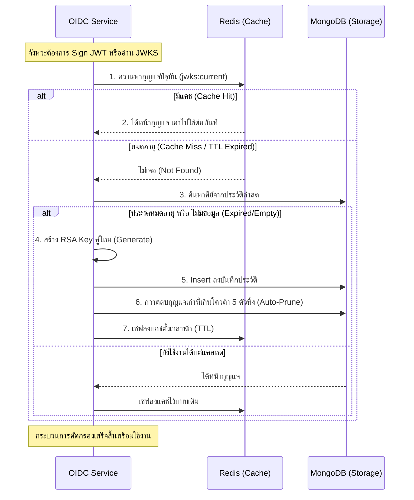

# Go OAuth 2.0 & OIDC Server

โปรเจกต์นี้คือเซิร์ฟเวอร์สำหรับจัดการการยืนยันตัวตน (Authentication) และสิทธิ์การเข้าถึง (Authorization) ที่พัฒนาขึ้นโดยใช้ภาษา Go โดยเน้นสถาปัตยกรรมแบบ Clean Architecture และรองรับมาตรฐานฟีเจอร์ของ **OAuth 2.0 ร่วมกับ OpenID Connect (OIDC)** 

---

## 🛠 Technology Stack
- **Language**: Go 1.22+ (ใช้ Standard Routing `net/http`)
- **Primary Database**: MongoDB (สำหรับเก็บ Users และ Clients)
- **Cache/Session/Transient Store**: Redis (สำหรับเก็บ Authorization Codes และ Token ชั่วคราว)
- **Cryptography**: `crypto/rsa`, `golang-jwt/jwt/v5` สำหรับแจก JWT และทำ JWKS

---

## 📂 โครงสร้างโปรเจกต์ (Project Structure)

โปรเจกต์นี้ยึดรูปแบบ Standard Layout และเน้นแยกส่วนโค้ดเพื่อให้อ่านง่าย:

├── cmd/
│   ├── client/                  # [NEW] แอปทดสอบ Ralying Party (ยิงขอดู OIDC) พอร์ต 3000
│   │   └── main.go              
│   └── server/
│       └── main.go              # จุดเริ่มต้นโปรแกรม OIDC Server พอร์ต 8080
├── internal/
│   ├── config/                  # จัดการตัวแปร Environment Variables
│   ├── adapters/                # เชื่อมต่อ Database และ Redis
│   │   ├── mongo_store/         # User, Client, RefreshToken, RSA Keys
│   │   └── redis_store/         # Cache (AuthCode, Session, Transaction)
│   ├── core/                    # **ส่วนกลาง** Business Logic ของ OIDC และ Model
│   │   ├── models/              
│   │   ├── ports/               
│   │   └── services/            # บริการต่างๆ (OAuthService, KeyService)
│   └── handlers/                # หน้าต่างรับ Request (HTTP Handlers)
│       ├── admin.go             # จัดการระบบขึ้นทะเบียน Client
│       ├── discovery.go         # API สำหรับ Discovery และ JWKS
│       ├── oauth.go             # API คุมการ Login, Token, Consent ฯลฯ
│       └── register.go          # ระบบสมัครสมาชิก
├── pkg/
│   └── crypto/                  # เครื่องมือ Helper (ระบบสร้าง RSA Key)
├── templates/                   # หน้าจอ UI ต่างๆ (Login, Consent, Admin)
├── docker-compose.yml           # ไฟล์ตั้งค่า Docker ประกอบร่าง Mongo/Redis
└── go.mod / go.sum

---

## 🚀 วิธีการรันโปรเจกต์ (How to run locally)

1. **เปิดตู้คอนเทนเนอร์ฐานข้อมูล (MongoDB & Redis)**
   เราได้เตรียม `docker-compose.yml` เอาไว้ให้แล้ว ให้สั่งคำสั่งนี้ที่ Root path ของโปรเจกต์:
   ```bash
   docker-compose up -d
   ```

2. **ดาวน์โหลด Dependencies ของ Go**
   ```bash
   go mod tidy
   ```

3. **สั่งรันเซิร์ฟเวอร์หลัก (OIDC Server)**
   เปิด Terminal ของคุณและสั่งรันขุมพลังหลักที่เตรียมมา:
   ```bash
   go run cmd/server/main.go
   ```
   *ใช้งานได้ที่ `http://localhost:8080/admin/dashboard` (User/Pass: `admin`/`admin_password`)*

4. **ทดสอบกับ Client App ตัวอย่าง**
   เมื่อสร้าง Client จากหน้า Admin Dashboard ของเซิร์ฟเวอร์หลักแล้ว ให้นำ `client_id` และ `client_secret` เข้าไปเปลี่ยนในบรรทัดแรกๆ ของโค้ด `cmd/client/main.go` จากนั้น... เปิด Terminal หน้าต่างที่สองแล้วสั่งรันขนานกันไปเลย:
   ```bash
   go run cmd/client/main.go
   ```
   *ใช้งานฝั่งแอปได้ที่ `http://localhost:3000`*

---

## 🗝️ สถาปัตยกรรม Key Management (JWKS)

ระบบการจัดการกุญแจเข้ารหัส (RSA Key Pair) สำหรับโปรเจกต์นี้ถูกออกแบบเป็น **Graceful Key Rotation แบบ Hybrid (MongoDB + Redis)** ทรงประสิทธิภาพระดับ Enterprise โดยทำงานผ่าน Cache เพื่อรองรับการสเกลแบบ Multiple Instances (Stateless):

1. **Redis Caching (`jwks:current`)**: ทำหน้าที่เป็นหน้าด่านคอยแคชกุญแจตัวปัจจุบัน (Active Key) ทำให้เซิร์ฟเวอร์ดึงไปแจก Access Token (JWT) ได้รวดเร็ว โดยผูก TTL หมดอายุตามค่าตัวแปร `KEY_ROTATION_DURATION` (ค่าตั้งต้น 30 วัน)
2. **MongoDB Fallback & Persistence**: ต้นแบบกุญแจจะถูกฝังประวัติไว้ใน Collection `keys` ถ้าระบบพบว่ากุญแจใน Redis หมดอายุการใช้งานแล้ว เซิร์ฟเวอร์จะสั่งปั่นกุญแจตัวใหม่ (Generate New Key) ส่งเข้าไปเรียงตัวใน MongoDB และดึงกลับไปพักใน Redis คืน ทำให้การผลัดเปลี่ยนกุญแจ (Key Rotation) เกิดขึ้นได้อย่างรวดเร็วและเป็นอัตโนมัติ
3. **Grace Period & Auto-Prune**: 
   - ระบบดูแล Token เก่าๆ อย่างนุ่มนวล โดยเมื่อมีคำขอมาที่ Endpoint `/jwks.json` แทนที่จะตอบแค่กุญแจตัวล่าสุดเพียงตัวเดียว ระบบจะเอาประวัติกุญแจเก่าที่เพิ่งหมดอายุไปไม่เกิน 14 วัน (`KEY_GRACE_PERIOD`) ส่งไปโชว์คู่กันด้วย ช่วยให้ระบบฝั่ง Client ยังคง Verify ค่าเก่าได้ไม่มีกระตุก (Downtime 0%)
   - **Auto-Prune**: ระบบจะควบคุมขยะและข้อมูลบวมใน Database ให้มีประวัติกองอยู่ไม่เกินเพดานสูงสุดตลอดกาล (`KEY_MAX_RETENTION_COUNT` = 5 อัน) กุญแจที่เกินจากโควต้าจะถูกลบกวาดทิ้งให้เองทันทีแบบเนียนๆ

### 📊 แผนภาพจำลองการทำงาน (Flow Diagram)



---

## 🌐 Endpoints ปัจจุบัน (API อ้างอิง)

### 📌 Discovery & Metadata
| Method | Endpoint | รายละเอียด |
| :-: | --- | --- |
| `GET` | `/.well-known/openid-configuration` | **OIDC Discovery**: แสดงค่า Metadata และความสามารถที่ Server นี้รองรับ |
| `GET` | `/jwks.json` | **JWKS**: ปล่อย Public Keys สำหรับให้ Client ตรวจสอบลายเซ็น JWT ด้วยตัวเอง |

### 🔐 OAuth & OIDC Core
| Method | Endpoint | รายละเอียด |
| :-: | --- | --- |
| `GET` | `/authorize` | จุดเริ่มต้นของ Authorization Code Flow รองรับพารามิเตอร์ PKCE |
| `POST` | `/login` / `/register` | ส่งคำขอเข้าสู่ระบบหรือสมัครสมาชิกเพื่อแลกเปลี่ยน Transaction ID |
| `GET/POST`| `/consent` | หน้าจอยินยอมสิทธิ์ (Consent Screen) รับรองการยิง Token กลับไปให้แพลตฟอร์มปลายทาง |
| `POST` | `/token` | แลกเปลี่ยน Authorization Code ให้กลายเป็นชุด `access_token`, `id_token` (JWT) และ `refresh_token` |
| `GET` | `/userinfo` | ปกป้องโปรไฟล์ผู้ใช้งานด้วย Access Token เพื่อตอบกลับตามมาตรฐาน OIDC |

### 🛑 Session & Security
| Method | Endpoint | รายละเอียด |
| :-: | --- | --- |
| `POST` | `/introspect` | ระบบเครื่องสแกนลายเซ็น (Introspection ตาม RFC 7662) เอาไว้ให้ API ข้างนอกยิงมาตรวจว่า Token นี้ของจริงและหมดอายุไปหรือยัง |
| `GET` | `/logout` | **RP-Initiated Logout**: ลงชื่อออกจากระบบขุดรากถอนโคนของ Session ภายใน OIDC ทั้งหมด |
| `POST` | `/revoke` | ทำลายล้าง `refresh_token` เก่า (ตาม RFC 7009) เวลาแอปฝั่งลูกข่ายต้องการปิดระบบ |

### 🛠️ Admin Zone
| Method | Endpoint | รายละเอียด |
| :-: | --- | --- |
| `GET` | `/admin/dashboard` | หน้าแสดงรายการและการสั่งสร้าง Client Application ใหม่ ปกป้องด้วย Basic Auth |
